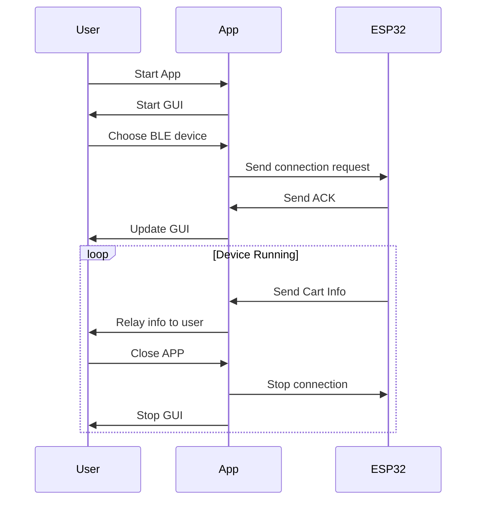

## Mobile-App
The gitignore have excluded some modules etc that we will need. Follow the guide below to get it working.
And remember to use the "Development build" once the emulator opens the app because the use of BLE is an extended feature outside Expo Go App

So in order to try the BLE functionality, after you've followed the installation steps and you've cloned the repo, you need to do the following:

Step1: Go to the repo and type
```
expo eject
```

Step2: Verify you got a ios and android folder, this means it successfully ejected the project for you. So you now have the ability to do BLE stuff.

# Installation (Linux)
We start by installing the modules our project need:

For, Arch or Ubuntu
```
sudo pacman -S nodejs npm
sudo apt-get install nodejs npm
```

Run this to get the necessary modules configured,
```
npm install
```

Now we continue with installing the Expo Go CLI:
```
npm install -g expo-cli
```

Now you should have the files needed, so you can proceed with cloning the repo.


## Running the app (Locally or Emulator)
# Locally
After you've downloaded the neccessary modules, installed them and you have cloned the repo, you can do the following:
```
cd /path/to/mobile-app-repo
npx expo start
```

From here you can follow the CLI on the screen, in android studio you need to create the emulator for our app (you can only use the emulator for the interface creation, BLE will have to be physically tested)

# Android studio (Emulator)
Download android studio and make sure you got the sdk folder, otherwise rename the folder since it is named Sdk. The app otherwise won't find it and can't start.

Create a new device emulator which is compatible with our code: 
- Select the Pixel 7 phone because it has google play on it
- Use/install the "S" version on it since it's the API31 for androids

After installation, start the emulator. Then connect the app to the emulator by pressing "a" in the expo CLI window in your terminal.
This should make the terminal start loading in the emulator on android studio for you.


